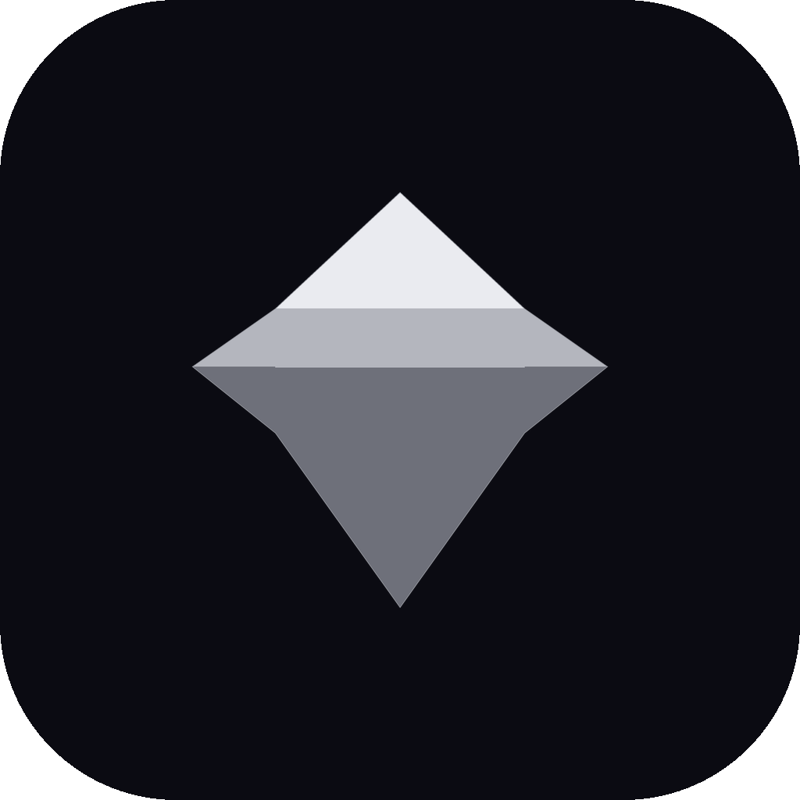

<div align="center">



# Onyx

**Private, on-device AI chat for iPhone — powered by Apple MLX.**

*Fork it, extend it, and ship your own private AI app.*

[](#)
[](LICENSE)
[](https://developer.apple.com/ios/)
[](https://swift.org)
[](https://github.com/ml-explore/mlx-swift-lm)
[](https://github.com/your-org/Onyx/pulls)

</div>

---

> [!IMPORTANT]
> **Requires a physical iPhone 15 or later.** The iOS Simulator has no Metal GPU and cannot run inference.

> [!WARNING]
> **iOS 27 beta is not yet supported.** The app may crash at launch on the iOS 27 beta (under investigation). Supported: **iOS 17.0 – iOS 26.x**.

---

## ✨ Features

|  |  |
|---|---|
| 🔒 **Fully private** | All inference runs on-device. No API keys, no accounts, no server calls after the model download. |
| ⚡ **Real-time streaming** | Tokens appear as fast as the model generates them. |
| 💎 **Ships with Llama 3.2 1B Instruct** | 4-bit quantised, ≈ 860 MB. Downloads publicly — no HuggingFace token — and activates automatically. |
| 📦 **Simple model management** | Download, activate, and uninstall models from a clean Models tab. Add more models with one line of code. |
| ⚙️ **Settings tab** | System prompt editor and developer toggles. |
| 🧠 **Memory-safe** | RAM gate blocks incompatible loads; the model auto-unloads on background and memory warnings. |
| 🦺 **Swift 6 strict concurrency** | Actors throughout; zero data races by construction. |

---

## 📸 Screenshots

<!-- Add screenshots once you have them. Suggested layout:

| Chat tab | Models tab |
|----------|------------|
|  |  |

Place 1242 × 2688 px (iPhone 15 Pro) captures at docs/chat.png and docs/models.png.
-->

*Coming soon.*

---

## 🚀 Getting started

### 1. Clone and open

```bash
git clone https://github.com/your-org/Onyx.git
cd Onyx
open Onyx/Onyx.xcodeproj
```

### 2. Set your team

Open **Onyx.xcodeproj → Targets → Onyx → Signing & Capabilities**, set your development team, and change the bundle id from `kiraa.Onyx` to something you own.

### 3. Run on a physical device

> **Important:** On-device inference requires a physical iPhone 15 or later. The iOS Simulator has no Metal GPU.

Select your device from the scheme picker, then **Product → Run** (⌘R).

### 4. Download a model

1. Tap the **Models** tab.
2. Tap **Download** next to *Llama 3.2 1B Instruct (4-bit)* (≈ 860 MB — use Wi-Fi).
3. The model activates automatically when the download completes.
4. Switch to the **Chat** tab and start chatting.

📖 New to iOS development? The step-by-step [QUICKSTART](QUICKSTART.md) takes you from a fresh Mac to a working app in under 30 minutes.

---

## 🛠 For developers

### What you get out of the box

| Capability | File |
|---|---|
| On-device MLX inference | `MLXModelManager.swift` |
| Real-time streaming token output | `ChatProvider.swift` + `generateFromModel()` |
| Multi-turn conversation history with auto-trimming | `MLXConversationHistory.swift` |
| Resumable HuggingFace model downloader (5-phase) | `ChatModelDownloader.swift` |
| Hardware RAM gate + background/low-mem unload | `HardwareProfile.swift`, `ChatMemoryGate.swift`, `OnyxApp.swift` |
| Model catalog (ships with Llama 3.2 1B) | `ChatModelCatalog.swift` |
| User settings (Settings tab, `SettingsView`) | `OnyxSettings.swift`, `PreferencesView.swift` |
| Installed/active model registry | `ChatModelRegistry.swift` |
| Sandbox-safe file path helpers | `OnyxPaths.swift` |

### What is intentionally left out

- **No persistence** — conversations reset on restart. Trivial to add (see below).
- **No accounts or API keys** — model downloads are public and unauthenticated; nothing leaves the device.
- **No theming** — plain system colors throughout; swap in your own design tokens.
- **No analytics or crash reporting** — add the SDK of your choice.

This deliberate minimalism keeps the diff small when you diverge from the skeleton.

### Quick extension recipes

**Add a model (one line):**

Open [ChatModelCatalog.swift](Onyx/Onyx/Download/ChatModelCatalog.swift) and append to `ChatModelCatalog.all` (the catalog ships with a single model — Llama 3.2 1B Instruct):

```swift
ChatModelDescriptor(
    id: "mlx-community/my-model-4bit",
    displayName: "My Model (4-bit)",
    family: .other,
    approxSizeBytes: Int64(4.0 * 1_073_741_824),  // ≈ 4 GB
    filePatterns: ChatModelCatalog.defaultFilePatterns,
    summary: "One-line description shown in the Models tab."
)
```

The downloader, registry, and Models tab UI pick it up automatically — no other changes needed. Browse available models at [huggingface.co/mlx-community](https://huggingface.co/mlx-community).

**Add conversation persistence:**

```swift
// Encode turns and write to the app's data directory:
let turns = await ChatProvider.shared.history.turns
let data = try JSONEncoder().encode(turns)
try data.write(to: OnyxPaths.baseDirectory().appending(path: "history.json"))

// Restore on launch:
let saved = try Data(contentsOf: OnyxPaths.baseDirectory().appending(path: "history.json"))
let turns = try JSONDecoder().decode([MLXConversationHistory.Turn].self, from: saved)
```

---

## 🏗 Architecture

```
Onyx/
├── Core Runtime
│   ├── OnyxPaths.swift               — Sandbox-safe paths (AppSupport/Onyx/)
│   ├── MLXErrors.swift               — Typed errors (metalUnavailable, modelNotInstalled, …)
│   ├── MLXModelManager.swift         — actor: ModelContainer lifecycle + generateFromModel()
│   └── MLXConversationHistory.swift  — actor: turn history, 16 K char / 10-pair auto-trim
│
├── Model Catalog & Registry
│   ├── ChatModelCatalog.swift        — Curated list of downloadable models
│   ├── ChatModelRegistry.swift       — actor: installed / active model tracking
│   ├── ChatModelDownloader.swift     — actor: 5-phase HuggingFace download + retry
│   ├── HardwareProfile.swift         — sysctl RAM/GPU detection; canLoadModel()
│   └── ChatMemoryGate.swift          — Pre-flight RAM check before load
│
├── Chat Layer
│   └── ChatProvider.swift            — @MainActor @Observable: UI ↔ MLX bridge
│
└── Views
    ├── OnyxApp.swift                 — @main entry point (no SwiftData)
    ├── ContentView.swift             — TabView: Chat + Models + Settings
    ├── ChatView.swift                — Scrollable chat UI with input bar
    ├── MessageBubble.swift           — Markdown-rendering message row
    ├── ThinkingDotsView.swift        — Animated 3-dot waiting indicator
    ├── ModelsView.swift              — Download / activate / uninstall list
    ├── DownloadRow.swift             — Live-progress model card
    └── PreferencesView.swift         — Settings tab (SettingsView)
```

### Data flow

```
User types → ChatView
  → ChatProvider.respond(to:)
    → MLXConversationHistory.buildMessages(systemPrompt:)
      → MLXModelManager.ensureLoaded(modelId:)     ← loads model lazily if needed
        → generateFromModel(container:messages:)   ← nonisolated, off main thread
          → AsyncStream<String>
            → ChatView appends tokens to the streaming bubble in real time
```

### Concurrency model

| Component | Isolation | Reason |
|---|---|---|
| `MLXModelManager` | `actor` | Single owner of `ModelContainer` |
| `MLXConversationHistory` | `actor` | Turn array written from UI and inference tasks |
| `ChatModelDownloader` | `actor` | Background download; pub/sub via `AsyncStream` |
| `ChatModelRegistry` | `actor` | File I/O to `active.txt` and model directories |
| `ChatProvider` | `@MainActor` | View-model; drives SwiftUI `@Observable` state |
| `generateFromModel()` | `nonisolated` | GPU-intensive; must not block the main thread |
| sysctl helpers | `nonisolated` | Called at app launch before any actor exists |

> The build setting `SWIFT_DEFAULT_ACTOR_ISOLATION = MainActor` makes **all** unannotated functions `@MainActor`. Functions that must run off-thread are explicitly `nonisolated`.

---

## 🔨 Build commands

```bash
# Resolve Swift packages and build for Simulator (UI compiles; no inference)
xcodebuild -project Onyx/Onyx.xcodeproj -scheme Onyx \
  -destination 'platform=iOS Simulator,name=iPhone 16' \
  -resolvePackageDependencies

xcodebuild build -project Onyx/Onyx.xcodeproj -scheme Onyx \
  -destination 'platform=iOS Simulator,name=iPhone 16'

# On-device inference: connect an iPhone 15+ and select it in Xcode's scheme picker, then ⌘R
```

---

## 📱 Hardware requirements

| Device | RAM | Status |
|---|---|---|
| iPhone 15 (base) | 6 GB | ✅ Supported |
| iPhone 15 Pro / Max | 8 GB | ✅ Supported |
| iPhone 16 (all models) | 8 GB | ✅ Supported |
| iPad Pro M2+ | 8–16 GB | ✅ Supported |
| iOS Simulator | — | ❌ No Metal GPU — UI works, inference does not |

> **OS support:** iOS 17.0 – 26.x. **iOS 27 beta is not yet supported** — see the warning at the top.

The `com.apple.developer.kernel.increased-memory-limit` entitlement allows the app to keep a 2 GB model resident on 6 GB devices. Call `MLXModelManager.shared.unloadModel()` when entering the background to free memory:

```swift
// In OnyxApp.swift (or a scene delegate):
.onChange(of: scenePhase) { _, phase in
    if phase == .background {
        Task { await MLXModelManager.shared.unloadModel() }
    }
}
```

---

## 🎛 Customisation reference

| Key | Storage | Default | Description |
|---|---|---|---|
| `onyx.systemPrompt` | UserDefaults | `"You are a helpful AI assistant…"` | System prompt injected before every conversation |
| `onyx.logPrompts` | UserDefaults | `true` | Log outgoing prompts to stdout (`📨 [Onyx]`) |

Change settings at runtime:

```swift
// System prompt
ChatProvider.shared.systemPrompt = "You are a pirate. Respond only in pirate speak."

// Silence debug logging
OnyxSettings.shared.logPrompts = false
```

### Model downloads

Downloads come straight from public [mlx-community](https://huggingface.co/mlx-community) repos on HuggingFace — no account, token, or API key is needed. Gated or private repos are not supported by this build.

---

## 🤝 Contributing

1. Fork the repo and create a feature branch: `git checkout -b feature/my-improvement`
2. Make your changes. The easiest first contribution is adding a model — one line in [`ChatModelCatalog.swift`](Onyx/Onyx/Download/ChatModelCatalog.swift).
3. Run the simulator build to confirm it compiles cleanly (see [Build commands](#-build-commands)).
4. Open a pull request — describe what it adds and why it belongs in a skeleton.

All contributions are welcome: new model descriptors, UI improvements, documentation, and tests.

---

## 📄 License

Apache 2.0 — see [LICENSE](LICENSE).

Built on:
- [mlx-swift-lm](https://github.com/ml-explore/mlx-swift-lm) — Apple's MLX Swift bindings
- [swift-transformers](https://github.com/huggingface/swift-transformers) — HuggingFace tokenizers
- Models from [mlx-community](https://huggingface.co/mlx-community) on HuggingFace

---

<div align="center">

**Onyx 0.1 beta** · Made for people who want their AI conversations to stay on their phone. 💎

</div>
